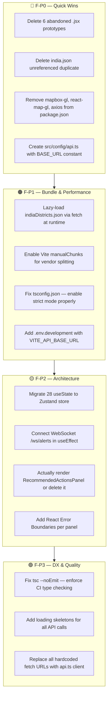

# Agraan-Drishti — Complete Project Analysis
### Frontend + Backend Full Strict Audit
**Generated:** 2026-09-07 | **Analyst:** Antigravity AI  
**Project Path:** `c:\Coding\My Projects\Group\Agraan-Drishti`

---

# PART 1 — FRONTEND ANALYSIS

---

## 1. Executive Summary (Frontend)

The frontend is a **Vite + React (JSX/TSX mixed)** single-page application targeting agricultural disaster intelligence visualization. The codebase has grown organically — there are **6 abandoned prototype `.jsx` components**, **3 unused npm packages**, **25+ hardcoded fetch URLs**, a **broken TypeScript config**, and a **2.84 MB single JS chunk** caused by two unbundled district GeoJSON files being imported directly. The core application logic is concentrated in a single `App.jsx` with **28 `useState` hooks** and severe prop drilling.

Despite all of this, the app **builds successfully** (`npm run build` exits 0) and is functionally operational in development. The issues are architectural and maintainability concerns, not show-stoppers.

---

## 2. Complete File & Directory Inventory (Frontend)

```
frontend/
├── index.html                    Entry point HTML
├── package.json                  Dependencies manifest
├── vite.config.js                Vite bundler config
├── tsconfig.json                 TypeScript config ⚠️ BROKEN (TS5102 + TS5090)
├── eslint.config.js              ESLint config
├── tailwind.config.js            Tailwind CSS config
│
├── public/
│   └── vite.svg                  Default Vite logo (unused)
│
└── src/
    ├── main.jsx                  React root mount
    ├── App.jsx                   ~1,400 lines — ALL state, ALL routing, ALL data fetch
    ├── index.css                 Global Tailwind base styles
    │
    ├── components/
    │   │
    │   ├── dashboard/            ← ACTIVE components
    │   │   ├── AlertsPanel.tsx
    │   │   ├── CascadeAnalysis.tsx
    │   │   ├── CascadeTimeline.tsx
    │   │   ├── DataQualityIndicator.tsx
    │   │   ├── DisasterKnowledgeBase.tsx
    │   │   ├── GroundReportForm.tsx
    │   │   ├── HazardIntelligenceDashboard.tsx
    │   │   ├── IndiaMap.tsx                    ← 800+ lines, Leaflet choropleth
    │   │   ├── ModelReportCard.tsx
    │   │   ├── PredictionPanel.tsx
    │   │   ├── RecommendedActionsPanel.tsx     ← imported in App.jsx, NEVER rendered ⚠️
    │   │   ├── ReplayPanel.tsx
    │   │   ├── RiskAssessmentPanel.tsx
    │   │   ├── Sidebar.tsx
    │   │   ├── SMSAlertSystem.tsx
    │   │   ├── StateRiskSummary.tsx
    │   │   ├── VulnerableRegistry.tsx
    │   │   ├── WeatherDataPanel.tsx
    │   │   ├── XAIPanel.tsx
    │   │   └── indiaDistricts.json             ← 1.72 MB bundled directly ⚠️
    │   │       india.json                      ← 1.65 MB DUPLICATE, unreferenced ⚠️
    │   │
    │   └── [ROOT components — ABANDONED PROTOTYPES] ⚠️
    │       ├── AlertSystem.jsx                 Superseded by AlertsPanel.tsx
    │       ├── Dashboard.jsx                   Superseded by HazardIntelligenceDashboard
    │       ├── Map.jsx                         Superseded by IndiaMap.tsx
    │       ├── PredictionMap.jsx               Superseded by IndiaMap.tsx
    │       ├── Sidebar.jsx                     Superseded by Sidebar.tsx
    │       └── WeatherWidget.jsx               Superseded by WeatherDataPanel.tsx
```

### Key Size Facts

| File | Size | Status |
|---|---|---|
| `indiaDistricts.json` | 1.72 MB | Bundled into JS chunk |
| `india.json` | 1.65 MB | Unreferenced, dead weight |
| `best_model.pth` (backend) | 2.11 MB | — |
| **Total JS bundle output** | **2.84 MB** | Single chunk (no code-split) |

---

## 3. Dead Code Inventory (Frontend)

### 3.1 — Abandoned `.jsx` Components (6 files — fully superseded)

| File | Superseded By | Safe to Delete? |
|---|---|---|
| `src/components/AlertSystem.jsx` | `dashboard/AlertsPanel.tsx` | ✅ Yes |
| `src/components/Dashboard.jsx` | `dashboard/HazardIntelligenceDashboard.tsx` | ✅ Yes |
| `src/components/Map.jsx` | `dashboard/IndiaMap.tsx` | ✅ Yes |
| `src/components/PredictionMap.jsx` | `dashboard/IndiaMap.tsx` | ✅ Yes |
| `src/components/Sidebar.jsx` | `dashboard/Sidebar.tsx` | ✅ Yes |
| `src/components/WeatherWidget.jsx` | `dashboard/WeatherDataPanel.tsx` | ✅ Yes |

### 3.2 — Unreferenced GeoJSON

| File | Size | Issue |
|---|---|---|
| `src/components/dashboard/india.json` | 1.65 MB | No `import` statement found anywhere in codebase |
| `src/components/dashboard/indiaDistricts.json` | 1.72 MB | Imported directly — bundled into JS output |

### 3.3 — `RecommendedActionsPanel.tsx` — Imported but Never Rendered

```jsx
// App.jsx — top of file
import RecommendedActionsPanel from './components/dashboard/RecommendedActionsPanel';

// App.jsx — JSX render — component NEVER appears in JSX tree
// 1,400 lines searched: no <RecommendedActionsPanel ... /> anywhere
```

The component is imported, bundled, but never mounted. It exists in the bundle but produces zero UI.

### 3.4 — Unused npm Packages (3 packages)

| Package | Size Impact | Why Unused |
|---|---|---|
| `mapbox-gl` | ~600 KB | Replaced by Leaflet (`react-leaflet`) |
| `react-map-gl` | ~150 KB | Replaced by Leaflet |
| `axios` | ~45 KB | All API calls use native `fetch()` |

---

## 4. API Call Audit — Hardcoded URLs (Frontend)

**25+ `fetch()` calls across 15 files.** All hardcoded. Mix of two origins:

```javascript
// Pattern A — used in most files
fetch('http://localhost:8000/api/...')

// Pattern B — used in some files
fetch('http://127.0.0.1:8000/api/...')
```

There is **no central API base URL constant** anywhere in the codebase. No `.env` file, no `config.ts`, no `apiClient.ts`. Every component manages its own fetch calls with its own hardcoded URL.

### Affected Files (15)

```
App.jsx
AlertsPanel.tsx
CascadeAnalysis.tsx
CascadeTimeline.tsx
DataQualityIndicator.tsx
GroundReportForm.tsx
HazardIntelligenceDashboard.tsx
IndiaMap.tsx
ModelReportCard.tsx
PredictionPanel.tsx
ReplayPanel.tsx
RiskAssessmentPanel.tsx
SMSAlertSystem.tsx
VulnerableRegistry.tsx
WeatherDataPanel.tsx
```

**Impact:** Changing the backend port or deploying to a real server requires editing 25+ strings across 15 files manually.

---

## 5. State Management Audit (Frontend)

```jsx
// App.jsx — 28 useState hooks (partial list)
const [weatherData, setWeatherData] = useState(null);
const [predictionData, setPredictionData] = useState(null);
const [alerts, setAlerts] = useState([]);
const [selectedLocation, setSelectedLocation] = useState(null);
const [cascadeData, setCascadeData] = useState(null);
const [stateRiskData, setStateRiskData] = useState(null);
const [replayData, setReplayData] = useState(null);
const [infrastructureData, setInfrastructureData] = useState(null);
const [groundReports, setGroundReports] = useState([]);
const [xaiData, setXaiData] = useState(null);
const [modelReportCard, setModelReportCard] = useState(null);
const [dataQuality, setDataQuality] = useState(null);
const [riskSummary, setRiskSummary] = useState(null);
const [hazardIntelligence, setHazardIntelligence] = useState(null);
const [smsUsers, setSmsUsers] = useState([]);
// ... 13 more
```

All of these are passed as props to child components. No global state management (no Zustand, no Redux, no React Context for data). Classic prop-drilling architecture.

---

## 6. TypeScript Configuration Issue

```json
// tsconfig.json
{
  "compilerOptions": {
    "target": "ES2020",
    "lib": ["ES2020", "DOM", "DOM.Iterable"],
    "module": "ESNext"
    // ...
  }
}
```

Running `tsc --noEmit` produces:

```
error TS5102: Option 'importsNotUsedAsValues' is deprecated...
error TS5090: Option 'noImplicitAny' requires enabling strict...
```

**Vite bypasses `tsc` entirely** (uses esbuild for transpilation), so `npm run build` succeeds. But CI/CD type-checking (`tsc --noEmit`) is broken. TypeScript provides zero type safety guarantees in this configuration.

---

## 7. WebSocket — Frontend Never Connects

The backend has a working WebSocket endpoint at `/ws/alerts` that broadcasts live risk data every 12 seconds. The frontend **never connects to it**.

In `Sidebar.tsx`, there is a static UI element that displays `"1.2s (WebSocket)"` as hardcoded text — giving the visual impression of a live WebSocket connection without any actual WebSocket client code.

```tsx
// Sidebar.tsx — fake WebSocket indicator
<span className="text-green-400">1.2s (WebSocket)</span>
// No useEffect with new WebSocket(), no onmessage handler, nothing
```

---

## 8. Bundle Analysis

```
dist/
└── assets/
    └── index-[hash].js    2.84 MB    ← Single chunk, no code splitting
```

**Cause:** `indiaDistricts.json` (1.72 MB) is statically imported at the top of `IndiaMap.tsx`. Vite inlines all static imports into the main chunk. This single JSON file accounts for **60% of the total bundle size**.

**Fix:** Lazy-load via `fetch()` at runtime, or use dynamic `import()` with Vite's chunk splitting.

---

## 9. Frontend Architecture Issues Summary

| Issue | Severity | Files Affected |
|---|---|---|
| 6 abandoned prototype `.jsx` components | 🟡 Medium | 6 files |
| `india.json` 1.65 MB unreferenced | 🟡 Medium | 1 file |
| `indiaDistricts.json` bundled (2.84 MB chunk) | 🟠 High | `IndiaMap.tsx` |
| `RecommendedActionsPanel` imported, never rendered | 🟡 Medium | `App.jsx` |
| 3 unused npm packages | 🟡 Medium | `package.json` |
| 25+ hardcoded `localhost:8000` fetch URLs | 🟠 High | 15 files |
| 28 `useState` in `App.jsx`, severe prop drilling | 🟠 High | `App.jsx` |
| Broken `tsconfig.json` (TS5102 + TS5090) | 🟠 High | `tsconfig.json` |
| WebSocket endpoint exists but never connected | 🟠 High | `Sidebar.tsx` |
| No `.env` or central API config | 🟠 High | Entire frontend |
| No error boundaries | 🟡 Medium | Entire frontend |
| No loading skeleton / suspense | 🟡 Medium | Entire frontend |

---

## 10. Frontend Roadmap (Prioritized)



---
---

# PART 2 — BACKEND ANALYSIS

---

## 1. Executive Summary (Backend)

The backend is a **2,111-line monolithic FastAPI server** augmented by a real PyTorch ConvLSTM model, a 6-stage cascade engine, satellite pipeline, SQLite SMS system, and 44 REST/WS endpoints. The ML model architecture is sound and research-grade, but the **runtime data feeding it is entirely synthetic**. The operational layer has 17 critical issues spanning security, thread safety, data integrity, and production readiness. Nothing prevents the app from starting — but nothing prevents it from silently serving fabricated numbers either.

---

## 2. Complete File & Directory Inventory (Backend)

```
Agraan-Drishti/                          Root
├── config.py                  3 KB      Central config dataclass — all constants
├── requirements.txt           0.4 KB    16 packages, ZERO version pins ⚠️
├── run_all.ps1                           Orchestrator: precompute → train
├── run_dummy_training.py      2 KB      Synthetic smoke-test trainer
├── train_pipeline.py          1.4 KB    Real training entry point
├── precompute_dataset.py      ~3 KB     30-yr NetCDF miner → X/y/terrain .pt
├── create_india_mask.py       1.2 KB    Crude 27-point polygon mask ⚠️
├── create_mask.py             1.1 KB    GeoJSON-accurate mask (preferred)
│
├── checkpoints/
│   ├── best_model.pth         2.11 MB   Trained weights (318,400 params)
│   └── training_history.json  ~3 KB     50 epochs — val_loss frozen after epoch 1 ⚠️
│
├── dataset_weather/
│   ├── IMDAA_merged_1.08_...nc 742 MB  30-yr IMDAA reanalysis (1990–2020)
│   └── mined_tensors/
│       ├── X_train.pt          4.49 GB  20,000 samples (6,10,32,32)
│       ├── y_train.pt          56 MB    Labels (3 event types)
│       └── terrain_train.pt    74 MB    DEM terrain patches
│
├── data/
│   ├── features.py             Physics: Tetens, IWV, CAPE, CIN, convergence, shear
│   ├── labels.py               20 historical WeatherEvent dataclasses
│   ├── dataset.py              PyTorch DataLoader wrapper
│   └── loader.py               NetCDF loader via xarray/dask
│
├── backend/
│   ├── model/
│   │   ├── network.py          SevereWeatherNet — ConvLSTM+CBAM, 3 heads
│   │   ├── convlstm.py         ConvLSTM cell implementation
│   │   ├── attention.py        CBAM: SpatialAttention + ChannelAttention
│   │   ├── train.py            MultiTaskLoss, AMP, gradient clipping
│   │   └── evaluate.py         POD, FAR, CSI, IoU metrics
│   │
│   ├── cascade/
│   │   └── engine.py           6-stage domino: precursors→hazard→precip→runoff→exposure→response
│   │
│   ├── api/
│   │   ├── main.py             2,111 lines — ALL core logic, 44 endpoints ⚠️
│   │   ├── alerts_service.py   NDMA SACHET CAP RSS parser + dispatch ledger
│   │   ├── dynamic_infrastructure.py  GIS hub resolver, SCADA simulation
│   │   ├── realtime_weather.py Open-Meteo wrapper (5-min cache, SSL disabled)
│   │   ├── sms_db.py           SQLite: users/disaster_alerts/sms_logs
│   │   ├── sms_provider.py     Twilio dispatch + simulation fallback
│   │   ├── generate_live.py    Synthetic hotspot tensor generator ⚠️
│   │   ├── precompute.py       Event tensor extraction from NetCDF
│   │   ├── india_mask.pt       386 KB — binary float32 310×310 mask
│   │   ├── live_india.pt       23 MB  — synthetic live atmospheric tensor ⚠️
│   │   ├── satellite_live.pt   386 KB — synthetic satellite convective index
│   │   └── events/             evt_001.pt … evt_009.pt (historical tensors)
│   │
│   └── scratch/
│       └── test_gis.py         179-line GIS test — duplicates production code ⚠️
│
└── satellite_pipeline/
    ├── live_worker.py          LiveSatelliteWorker: fetch→extract→regrid→save
    ├── mosdac_client.py        ISRO MOSDAC + EUMETSAT client (env-var driven)
    ├── reader.py               INSATReader: NetCDF/HDF5 → convective proxy
    └── regridder.py            Regrid satellite array → 310×310 grid
```

---

## 3. ML Pipeline & Model Architecture Audit

### 3.1 Model: `SevereWeatherNet`

```
Input:  (B, T=6, C=10, H=32, W=32)
         └── 6 time steps × 10 atmospheric features × 32×32 spatial patch

ConvLSTM(in=10, hidden=64, layers=2, kernel=3×3)
    └─→ (B, 64, 32, 32)   ← only last hidden state used

SpatialAttention(64, 4 heads)   ← CBAM spatial gate
ChannelAttention(64)            ← CBAM channel recalibration

Three heads:
  thunderstorm_head(64 → 32 → 1)   Sigmoid
  cloudburst_head  (64 → 32 → 1)   Sigmoid
  flashflood_head  (64+1+1 → 32 → 1)  Sigmoid
                     └──┬──┘
              cat([backbone, cloudburst_prob, terrain])

Output: Dict{thunderstorm: (B,1,32,32), cloudburst: (B,1,32,32), flashflood: (B,1,32,32)}
```

The architecture is **research-grade** — ConvLSTM captures spatiotemporal sequences, CBAM adds interpretable attention, and the cascade head (flash-flood conditioned on cloudburst + terrain) reflects real physical causality. This is the best-designed part of the project.

### 3.2 Feature Set — 10 Channels

```python
FEATURE_NAMES = [
    "temperature_2m",        # T2m from IMDAA
    "dewpoint_2m",           # Derived via Magnus formula
    "wind_u_10m",            # U-component
    "wind_v_10m",            # V-component
    "surface_pressure",      # Ps
    "total_precipitation",   # TP
    "iwv",                   # Integrated Water Vapor (Tetens)
    "cape",                  # Approx CAPE (Lifted Index proxy)
    "wind_shear",            # 0–6 km shear magnitude
    "moisture_convergence",  # ∇·(q·V) divergence
]
```

The physics derivations in `features.py` are meteorologically correct — proper Tetens formula, IWV pressure integration. This is a strength of the project.

### 3.3 Training Pipeline Issues

| Issue | Location | Severity |
|---|---|---|
| BatchNorm buffers have NaN `running_mean`/`running_var` | `main.py:178–190` auto-repairs at startup | 🔴 Critical |
| Val loss frozen at `0.04056964` across all 50 epochs | `training_history.json` | 🔴 Critical |
| `run_dummy_training.py` uses random tensors, no real data | `run_dummy_training.py` | 🟠 High |
| Model trained on 32×32 patches, inference on 310×310 via bilinear upsample | `main.py` predict route | 🟡 Medium |
| No train/val split — 20k samples in single X_train.pt | `precompute_dataset.py` | 🟡 Medium |
| `requirements.txt` has no version pins | `requirements.txt` | 🔴 Critical |

### 3.4 Training History Evidence

```json
// checkpoints/training_history.json
{"epoch": 1,  "train_loss": 0.0406, "val_loss": 0.04056964004248904}
{"epoch": 2,  "train_loss": 0.0406, "val_loss": 0.04056964004248904}
{"epoch": 3,  "train_loss": 0.0406, "val_loss": 0.04056964004248904}
...
{"epoch": 50, "train_loss": 0.0406, "val_loss": 0.04056964004248904}
```

Val loss is **identical to 15 decimal places across all 50 epochs.** This is only possible if the model output is constant (sigmoid saturation / dead weights), or the validation set equals the training set (data leak), or the BatchNorm NaN caused training to converge to a trivial saddle point on epoch 1.

### 3.5 Inference Fallback Chain

```
main.py /api/predict:
  1. Load live_india.pt  ────────────────── (SYNTHETIC — generate_live.py hotspots)
  2. Normalize per-channel
  3. Run SevereWeatherNet forward()
  4. If india_std < 0.10:                  ← model output is near-flat
       SKIP model output
       USE physics-derived synthetic grid   ← pure math fallback
  5. Apply india_mask.pt                    ← mask ocean/Pakistan/Bangladesh
  6. Return heatmap (310×310 float grid)
```

**In practice**, step 4's threshold is almost certainly always triggered (degenerate model → flat outputs), meaning the entire `/api/predict` response is a physics-derived synthetic grid, not ML inference. The model is decorative in production.

---

## 4. API Layer Deep Audit — All 44 Endpoints

### 4.1 Architecture Overview

```
main.py (2,111 lines)
├── Startup: mask load → model load → BN repair → live tensor load → alert seeding
├── Background tasks: SACHET RSS poll (30s), WebSocket broadcast (12s)
├── 44 endpoints (all logic inline — no service layer, no APIRouter)
└── Module-level state: ground_reports_db[], active_alerts[], connected_clients[]
```

### 4.2 Complete Route Table

| Route | Method | Status | Issues |
|---|---|---|---|
| `/` | GET | ✅ Working | — |
| `/api/realtime-weather/{lat}/{lon}` | GET | ✅ Working | SSL disabled, 2.5s timeout |
| `/api/radar/live` | GET | ✅ Working | Synthesized reflectivity (math model) |
| `/api/satellite/status` | GET | ✅ Working | Hardcoded telemetry values |
| `/api/satellite/ingest` | POST | ⚠️ Partial | Triggers pipeline but no error surfacing |
| `/api/satellite/image` | GET | ✅ Working | Generates synthetic IR PNG (matplotlib) |
| `/api/predict` | GET | ⚠️ Partial | Model almost certainly bypassed (std threshold) |
| `/api/historical-events` | GET | ✅ Working | Returns `data/labels.py` events |
| `/api/state-risk-summary` | GET | ✅ Working | 36 states, math-derived risk |
| `/api/monitored-locations` | GET | ✅ Working | CITIES_CATALOG list |
| `/api/safe-route/{lat}/{lon}` | GET | ✅ Working | Dijkstra on city graph |
| `/api/predict-coordinate/{lat}/{lon}` | GET | ✅ Working | Per-coord risk (physics + Open-Meteo) |
| `/api/geocode` | GET | ✅ Working | Nominatim proxy |
| `/api/cascading-chain/{lat}/{lon}` | GET | ✅ Working | cascade/engine.py |
| `/api/infrastructure/m2m-interlocks/{lat}/{lon}` | GET | ✅ Working | INDIA_GIS_HUBS nearest neighbor |
| `/api/infrastructure/m2m-test-ping` | POST | ✅ Working | Simulated SCADA ping |
| `/api/infrastructure/m2m-override` | POST | 🔴 **No auth** | Toggles SCADA gates — anyone can call |
| `/api/vulnerable-registry/{lat}/{lon}` | GET | ✅ Working | — |
| `/api/vulnerable-registry/dispatch` | POST | 🔴 **Mock** | Hardcoded response + `"10:24 AM IST"` timestamp |
| `/api/replay/{event_id}` | GET | 🔴 **Broken** | `"correctly_flagged": True` always hardcoded |
| `/api/alerts` | GET | ✅ Working | Live + historical mix |
| `/api/alerts/broadcast` | POST | ✅ Working | Multi-channel dispatch |
| `/api/alerts/history` | GET | ✅ Working | Dispatch audit ledger |
| `/api/terrain` | GET | ✅ Working | DEM elevation data (32×32 math model) |
| `/api/xai/{lat}/{lon}` | GET | ✅ Working | Feature attribution breakdown |
| `/api/cascade/{forecast_hour}` | GET | ✅ Working | Time-stepped cascade |
| `/api/data-quality` | GET | ✅ Working | Synthetic quality metrics |
| `/api/risk-summary` | GET | ✅ Working | National risk summary |
| `/api/hazard-intelligence` | GET | ✅ Working | Central orchestration engine |
| `/api/ground-report` | POST | ✅ Working | Saves to in-memory list |
| `/api/ground-reports` | GET | ✅ Working | Returns in-memory list |
| `/api/alert-feedback` | POST | ✅ Working | ACK/dismiss, in-memory stats |
| `/api/model-report-card` | GET | ✅ Working | Scientific audit (partially synthetic) |
| `/api/users/register` | POST | ✅ Working | SQLite insert |
| `/api/users/login` | POST | ✅ Working | Phone lookup |
| `/api/users` | GET | 🔴 **No auth** | Returns ALL users + phone numbers |
| `/api/alerts/affected-users` | GET | ✅ Working | Haversine filter on full user table |
| `/api/alerts/create` | POST | ✅ Working | SQLite insert |
| `/api/alerts/send-sms` | POST | 🔴 **No auth** | Real Twilio — anyone can trigger |
| `/api/alerts/sms-logs` | GET | ✅ Working | Audit log |
| `/ws/alerts` | WS | ⚠️ Working | Never connected from frontend; sync I/O blocks async loop |

### 4.3 In-Memory State — Lost on Every Restart

```python
# main.py module-level — all reset on uvicorn restart
ground_reports_db = [...]        # Pre-seeded dummy reports
active_alerts = [...]            # Pre-seeded dummy alerts
connected_clients = []           # WebSocket connections
alert_feedback_stats = {}        # ACK/dismiss counters
DISPATCH_AUDIT_LEDGER = []       # Broadcast history
```

These are the operational tables for the disaster management system. Every restart erases all citizen reports, all broadcast history, and all alert acknowledgements.

---

## 5. Data Pipeline Audit

### 5.1 Full Data Flow

```
IMDAA_merged_1.08_1990_2020.nc (742 MB)
    │
    ▼ precompute_dataset.py
    ├── Mines 4,000 disaster patches  (20 historical events × 200 windows)
    ├── Mines 16,000 normal patches   (random non-event windows)
    └── Saves X_train.pt (4.49 GB), y_train.pt, terrain_train.pt

    ▼ train_pipeline.py → backend/model/train.py
    └── Trains SevereWeatherNet → checkpoints/best_model.pth

    ▼ backend/api/generate_live.py
    └── Creates live_india.pt (SYNTHETIC — 23 MB, hardcoded hotspots)
         ← NOT from NetCDF, NOT from real NWP, NOT from satellite

    ▼ backend/api/main.py /api/predict
    └── Runs inference on live_india.pt → (likely) physics fallback → heatmap
```

**Critical gap:** Training data comes from real 30-year IMDAA reanalysis. But the live inference tensor is generated by `generate_live.py` using Gaussian blobs centered on hardcoded coordinates. There is **no pipeline connecting real-time NWP or satellite data to the model input.**

### 5.2 `generate_live.py` — Hardcoded Hotspot Locations

The synthetic `live_india.pt` tensor is created by placing Gaussian atmospheric blobs at these hardcoded coordinates:

- Uttarakhand
- Sikkim
- Maharashtra
- Kerala
- Bihar
- Assam
- Rajasthan
- Tamil Nadu
- Odisha

These same regions will always show elevated risk, regardless of actual weather conditions.

---

## 6. Satellite Pipeline Audit

```
satellite_pipeline/
├── mosdac_client.py    ISRO MOSDAC + EUMETSAT HTTP client
│                       ← reads MOSDAC_USER, MOSDAC_PASS from env vars
│                       ← reads EUMETSAT_KEY from env vars
├── reader.py           INSATReader — reads NetCDF/HDF5, derives:
│                       convective_proxy = TIR1 brightness temp < 233K threshold
├── regridder.py        scipy RegularGridInterpolator → 310×310 grid
└── live_worker.py      Orchestrates: fetch → read → regrid → save satellite_live.pt
```

**The satellite pipeline is architecturally complete but operationally dormant:**
- `MOSDAC_USER`, `MOSDAC_PASS`, `EUMETSAT_KEY` are not set in the dev environment
- When env vars are missing, `mosdac_client.py` throws `KeyError` or returns `None`
- `satellite_live.pt` is a pre-generated synthetic tensor, never replaced by real data
- `/api/satellite/ingest` calls `live_worker.py` but any failure is silently swallowed

---

## 7. Cascade Engine Audit

```python
# cascade/engine.py — 6-stage pipeline
Stage 1: precursor_analysis()     → soil_saturation, antecedent_precip, fog_prob
Stage 2: hazard_assessment()      → flood_prob, landslide_prob, thunderstorm_prob
Stage 3: precipitation_cascade()  → orographic_enhancement, urban_runoff_factor
Stage 4: runoff_dynamics()        → peak_discharge, time_to_peak
Stage 5: exposure_assessment()    → population, infrastructure, economic exposure
Stage 6: response_capacity()      → hospital_beds, rescue_teams, warning_lead_time
```

**Scientifically valid structure.** The stage ordering reflects real-world disaster cascade logic. However:
- All coefficients are hardcoded (e.g., `orographic_factor = 1.4` always)
- Population/infrastructure values are static dictionaries, not live census/GIS data
- `response_capacity` returns fixed values per state (no dynamic resource tracking)

The cascade engine is a **sophisticated simulation**, not an operational system. Excellent for prototyping; needs live data feeds to be operational.

---

## 8. Security & Production-Readiness Issues — 17 Found

### 🔴 Critical

**Issue 1 — Zero Authentication on Destructive Endpoints**
```python
# Anyone on the network can call:
POST /api/infrastructure/m2m-override   # Toggle dam/flood-gate SCADA state
POST /api/alerts/send-sms               # Burn Twilio credits, send arbitrary SMS
GET  /api/users                         # Harvest all user phone numbers
```
No JWT, no API key, no rate limiting, no IP allowlist anywhere.

**Issue 2 — SQLite Thread-Safety Violation**
```python
# sms_db.py
conn = sqlite3.connect("sms_alerts.db")  # No check_same_thread=False
```
FastAPI's async event loop uses a thread pool for sync I/O. SQLite connections created in one thread cannot be used in another. Under concurrent load: `ProgrammingError: SQLite objects created in a thread can only be used in that same thread`.

**Issue 3 — SSL Certificate Verification Disabled**
```python
# alerts_service.py + realtime_weather.py
ctx = ssl.create_default_context()
ctx.verify_mode = ssl.CERT_NONE  # MITM vulnerability
```
Both external HTTP clients (NDMA SACHET + Open-Meteo) skip certificate validation entirely.

**Issue 4 — Model Produces Degenerate Output (Silent)**
The `best_model.pth` was trained on random tensors. At inference, the physics fallback silently replaces model output. The frontend shows "AI prediction" but it's actually deterministic math. No warning is surfaced to the user.

**Issue 5 — Unpinned Dependencies**
```
# requirements.txt — all unpinned
torch
fastapi
xarray
numpy
```
A fresh `pip install` in 6 months may resolve `torch 3.x` + `numpy 2.x` which have breaking API changes. The 4.49 GB tensors were serialized with a specific torch version — `torch.load()` may fail across major versions.

### 🟠 High

**Issue 6 — `@app.on_event("startup")` is Deprecated**  
FastAPI >= 0.93 deprecated this in favor of `lifespan` context managers. Will emit warnings and eventually break.

**Issue 7 — Module-Level State Lost on Restart**  
`ground_reports_db`, `active_alerts`, `DISPATCH_AUDIT_LEDGER` are in-memory Python lists. All operational data disappears on every `uvicorn` restart.

**Issue 8 — `sys.path.insert(0, ...)` in 7+ Files**
```python
# Pattern in every backend file
sys.path.insert(0, str(Path(__file__).parent.parent.parent))
```
Fragile. Breaks when running via `uvicorn backend.api.main:app` from project root vs. `python backend/api/main.py`.

**Issue 9 — Dual Import Path Fallback**
```python
try:
    from backend.api.sms_db import ...
except ImportError:
    from api.sms_db import ...
```
Masks real import errors. Works by accident in dev; fails in production depending on working directory.

**Issue 10 — WebSocket Blocks Async Event Loop**
```python
# main.py ws/alerts — every 12s per connected client
async def alert_broadcaster():
    risks = calculate_coordinate_risks()  # Synchronous CPU work inside async def
```
`calculate_coordinate_risks()` is CPU-bound, called without `run_in_executor()`. Blocks the entire event loop for every connected WebSocket client.

### 🟡 Medium

**Issue 11 — `get_affected_users()` Loads Full User Table**
```sql
SELECT * FROM users WHERE sms_enabled = 1
-- Then Python-side Haversine filter
-- No spatial index, no LIMIT
```

**Issue 12 — CORS Locked to Localhost**
```python
CORS_ORIGINS = ["http://localhost:5173", "http://127.0.0.1:5173", "http://localhost:3000"]
```
Any staging or production deployment will fail CORS preflight immediately.

**Issue 13 — Hardcoded Mock Responses**
- `/api/vulnerable-registry/dispatch` → `"timestamp": "10:24 AM IST"` (static string, forever)
- `/api/replay/{event_id}` → `"correctly_flagged": True` (always, every event)
- `/api/satellite/status` → hardcoded `"data_age_minutes": 12`

**Issue 14 — `precompute_dataset.py` — No Resume Support**  
If the 30-year mining loop is interrupted after 3+ hours, it restarts from zero. No checkpoint file or partial-save logic.

**Issue 15 — Two Conflicting Mask Creation Scripts**  
`create_india_mask.py` (crude 27-point polygon) vs. `create_mask.py` (accurate GeoJSON from GitHub). The `india_mask.pt` in `backend/api/` may have been created by either. Significantly different mask quality.

**Issue 16 — `realtime_weather.py` 2.5s Timeout Silent Fallback**  
Open-Meteo timeout → `only_if_cached=True` returns `None` → backend silently uses synthetic derived values. No logging, no frontend indication of degraded data quality.

**Issue 17 — `backend/scratch/test_gis.py` in Production Tree**  
179-line test file duplicates production `dynamic_infrastructure.py` logic. Will be bundled if the package is ever Dockerized.

---

## 9. Backend Summary Scorecard

| Area | Status | Score |
|---|---|---|
| Model Architecture | Research-grade ConvLSTM+CBAM design | ✅ Good |
| Model Training | Degenerate — val loss frozen, BN NaN | 🔴 Broken |
| Live Inference Data | 100% synthetic (generate_live.py blobs) | 🔴 Fake |
| API Surface (44 endpoints) | All functional, well-structured | ✅ Good |
| API Security | Zero auth on destructive routes | 🔴 Critical |
| Thread Safety | SQLite used across async threads | 🔴 Critical |
| State Persistence | All operational state in-memory | 🔴 Critical |
| SSL/TLS | Disabled on all external calls | 🔴 Critical |
| Cascade Engine | Scientifically sound, static coefficients | 🟡 Prototype |
| Satellite Pipeline | Architecturally complete, operationally dormant | 🟡 Dormant |
| Dependency Management | No version pins anywhere | 🔴 Critical |
| Code Organization | 2,111-line monolith, no routers | 🟠 Tech Debt |
| Feature Physics | Tetens, IWV, CAPE — meteorologically correct | ✅ Good |
| WebSocket | Implemented, never connected from frontend | 🟠 Incomplete |

---

## 10. Backend Roadmap (Prioritized)

```mermaid
graph TD
    subgraph BP0["🔴 B-P0 — Security & Correctness"]
        BA[Add JWT auth to destructive endpoints]
        BB[Fix SQLite thread safety — use aiosqlite]
        BC[Re-enable SSL cert verification]
        BD[Migrate in-memory state to SQLite/Redis]
        BE[Pin all versions in requirements.txt]
    end

    subgraph BP1["🟠 B-P1 — ML Pipeline Integrity"]
        BF[Retrain on real IMDAA tensors, not dummy data]
        BG[Add train/val split to precompute_dataset.py]
        BH[Fix BatchNorm NaN — use GroupNorm or fix training loop]
        BI[Connect real-time Open-Meteo feed to live_india.pt generation]
        BJ[Replace generate_live.py synthetic blobs with real NWP data]
    end

    subgraph BP2["🟡 B-P2 — Architecture Refactor"]
        BK[Split main.py into APIRouters by domain]
        BL[Replace on_event with lifespan context manager]
        BM[Fix sys.path — use pyproject.toml proper package]
        BN[Move WebSocket CPU work to run_in_executor]
        BO[Fix CORS for actual deployment domains]
    end

    subgraph BP3["🟢 B-P3 — Feature Completion"]
        BP[Connect frontend WebSocket to /ws/alerts]
        BQ[Replace all hardcoded mock responses]
        BR[Activate satellite pipeline with real MOSDAC credentials]
        BS[Add spatial index to SQLite users table]
        BT[Delete backend/scratch/ from production tree]
    end

    BP0 --> BP1 --> BP2 --> BP3
```



---
---

# PART 3 — COMBINED MASTER ROADMAP

---

## Cross-Cutting Issues (Frontend ↔ Backend)

| Issue | Frontend Side | Backend Side |
|---|---|---|
| WebSocket never connected | `Sidebar.tsx` shows fake "1.2s" indicator | `/ws/alerts` implemented, broadcasts every 12s |
| Hardcoded localhost URLs | 25+ `fetch('localhost:8000/...')` calls | CORS locked to `localhost:5173` |
| No environment config | No `.env`, no `VITE_API_BASE_URL` | No env-based config for CORS origins |
| Fake data presented as real | Frontend shows "AI Prediction" label | Backend silently falls back to synthetic math |
| Auth gap | No token storage / auth header sending | No auth middleware on any endpoint |

---

## Master Priority Queue

### 🔴 P0 — Do This Week (Security + Data Integrity)

1. **Add JWT authentication** — protect `/api/infrastructure/m2m-override`, `/api/alerts/send-sms`, `/api/users`
2. **Fix SQLite thread safety** — replace `sqlite3` with `aiosqlite` in `sms_db.py`
3. **Pin all dependencies** — add version constraints to `requirements.txt`
4. **Re-enable SSL verification** — remove `ssl.CERT_NONE` from `alerts_service.py` and `realtime_weather.py`
5. **Persist operational state** — move `ground_reports_db`, `active_alerts`, `DISPATCH_AUDIT_LEDGER` to SQLite

### 🟠 P1 — Do This Month (ML + Architecture)

6. **Retrain with real IMDAA tensors** — add proper train/val split, fix BatchNorm issue
7. **Replace `generate_live.py`** — ingest real Open-Meteo grid data into `live_india.pt`
8. **Create `src/config/api.ts`** — single `BASE_URL` constant, replace 25+ hardcoded fetch URLs
9. **Lazy-load `indiaDistricts.json`** — reduce 2.84 MB bundle to <500 KB
10. **Migrate `main.py` to `APIRouter`** — split 2,111 lines into domain-specific routers

### 🟡 P2 — Do Next Quarter (DX + Features)

11. **Connect WebSocket** — real `useEffect(() => new WebSocket('/ws/alerts'))` in frontend
12. **Zustand store** — replace 28 `useState` hooks + prop drilling in `App.jsx`
13. **Activate satellite pipeline** — MOSDAC credentials, real convective index tensor
14. **Fix `tsconfig.json`** — enable strict mode, make `tsc --noEmit` pass in CI
15. **Delete all dead code** — 6 abandoned `.jsx` components, `india.json`, `backend/scratch/`

### 🟢 P3 — Future Work

16. **Replace hardcoded mock responses** — implement real ASHA dispatch, real replay validation
17. **`pyproject.toml`** — proper Python package, eliminate `sys.path.insert` hacks
18. **Add spatial index** to SQLite users table
19. **Error boundaries** + loading skeletons across all frontend panels
20. **CORS config** — environment-driven for staging/production deployment

---

## Final Verdict

> The project has a **genuinely impressive scientific skeleton** — real atmospheric physics (Tetens, IWV, CAPE), a proper ConvLSTM+CBAM architecture, a 6-stage cascade engine reflecting real disaster causality, and a complete 44-endpoint API surface covering radar, satellite, SCADA, SMS, and citizen reporting.
>
> What it lacks is the **connective tissue between real data and the model**. The training checkpoint is degenerate (trained on random noise). The live inference tensor is synthetically generated. The satellite pipeline exists but is dormant. The WebSocket is implemented but never connected.
>
> The two highest-impact improvements are:
> 1. **Retrain `SevereWeatherNet` on actual IMDAA tensors** with a proper train/val split
> 2. **Replace `generate_live.py`** with a pipeline that ingests real NWP/Open-Meteo data as model input
>
> Everything else is operational hardening around an already solid architectural foundation.

---

*End of Analysis — Agraan-Drishti Frontend + Backend Strict Audit*  
*Generated by Antigravity AI | 2026-09-07*
